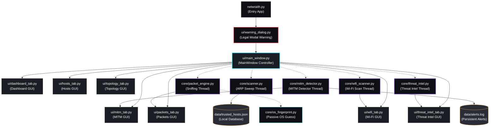

<h1 align="center">🕷️ NetWraith</h1>
<p align="center">
  <b>The high-key aesthetic, low-key lethal network security analysis suite.</b>
</p>

<p align="center">
  
  
  
  
</p>

---

<div align="center">
  <h3>
    <a href="#-architecture">Architecture</a> •
    <a href="#-features">Features</a> •
    <a href="#-vibe-check-comparison">Vibe Check</a> •
    <a href="#-installation">Installation</a> •
    <a href="#-legal">Legal</a>
  </h3>
</div>

---

> [!WARNING]
> **UNAUTHORIZED USE IS HIGH-KEY CRINGE AND ILLEGAL.**
> Running packet sniffers or auditing networks you don’t own or lack explicit written authorization to test violates local computer laws. Keep it in your lab environment. Protect your packets responsibly.

---

## 🏗️ Architecture Flow

NetWraith splits UI management and raw packet processing. Background modules leverage native Python threads to feed real-time events straight to the PyQt6 dashboard.



---

## ⚡ The Feature Panels

<table width="100%">
  <tr>
    <td width="50%">
      <h3>📊 Dashboard Engine</h3>
      <p>Features a custom 60-second rolling <code>pyqtgraph</code> sparkline tracking packets/sec with zero latency. Houses metric panels, recent alert logs, and quick action launch routes.</p>
    </td>
    <td width="50%">
      <h3>🕸️ Interactive 2D Topology Map</h3>
      <p>Plots discovered network hosts in a live 2D draggable layout centered around the default gateway. Colored by status, double-clicking any host opens port scanning directly.</p>
    </td>
  </tr>
  <tr>
    <td width="50%">
      <h3>🖥️ Subnet Host Discovery</h3>
      <p>Runs automated ARP sweeps. Compares discoveries against <code>trusted_hosts.json</code> to flag <code>NEW</code>, <code>CHANGED</code>, or <code>SUSPICIOUS</code> devices on the fly.</p>
    </td>
    <td width="50%">
      <h3>🕵️ Passive OS Fingerprinting</h3>
      <p>Analyzes TTL, Window size, and Don't Fragment (DF) flags from real-time TCP packet headers to passively profile device operating systems without active scans.</p>
    </td>
  </tr>
  <tr>
    <td width="50%">
      <h3>🛡️ ARP Poison Monitoring</h3>
      <p>Sniffs incoming ARP replies to catch MAC spoofing, poisoning, or unsolicited gratuitous packets. Deduplicates spam alerts within a 30s window.</p>
    </td>
    <td width="50%">
      <h3>🌐 DNS Tunnel Detector</h3>
      <p>Tracks DNS queries over port 53. Flags suspected tunneling attempts (labels > 50 chars) and high rate queries from single nodes.</p>
    </td>
  </tr>
  <tr>
    <td width="50%">
      <h3>📦 Packet Inspector</h3>
      <p>Aesthetic color-coded stream (TCP, UDP, ARP, ICMP, DNS) with full hierarchical layer tree breakdown, hex dumps, and PCAP exports.</p>
    </td>
    <td width="50%">
      <h3>🔍 Threaded Port Scanner</h3>
      <p>Concurrent port sweeps (1–500 threads) supporting TCP Connect, SYN, and UDP scans with banner grabbing and port mapping.</p>
    </td>
  </tr>
  <tr>
    <td width="50%">
      <h3>📡 Rogue DHCP Detector</h3>
      <p>Caches the subnet's valid DHCP server lease configuration. Triggers warnings if a rogue lease offer is broadcasted.</p>
    </td>
    <td width="50%">
      <h3>🔒 Certificate Inspector</h3>
      <p>Extracts TLS cert paths. Validates signatures, expiration timelines, weak SHA1/MD5 algos, and subject CN name conflicts.</p>
    </td>
  </tr>
  <tr>
    <td width="50%">
      <h3>📶 Wi-Fi Spectrum Auditor</h3>
      <p>Audits local 2.4 GHz and 5 GHz airwaves. Generates a live PyQtGraph channel curve visualization showing signal overlap and wireless channel congestion.</p>
    </td>
    <td width="50%">
      <h3>🌍 Threat Intelligence & GeoIP</h3>
      <p>Profiles destination IP addresses captured from public packets in real-time, fetching country, ISP, and organization details, alongside calculated threat metrics.</p>
    </td>
  </tr>
</table>

---

## 🕵️ MITM Detection Stack

NetWraith runs a dedicated 5-vector monitor to catch Man-in-the-Middle attacks before they compromise your data:

> [!IMPORTANT]
> **MITM Threat Vectors Checked:**
> 1. **Gateway MAC Modification:** Detects when the gateway IP suddenly resolves to a different MAC address (indicating intercept).
> 2. **Duplicate Local IP:** Sends ARP sweeps for the host's own IP to ensure no duplicate systems are spoofing identity.
> 3. **ICMP Redirect Sniffing:** Flags ICMP type 5 packets suggesting bad routing updates.
> 4. **Gateway TTL Shifts:** Flags sudden shifts in the gateway's time-to-live response bounds.
> 5. **MAC Table Conflicts:** Flags when multiple distinct IPs map to a single hardware MAC.

---

## 📊 Vibe Check: Tool Comparison

<div align="center">

| Feature | NetWraith 🕷️ | Wireshark 🦈 | Bettercap 🧢 |
| :--- | :---: | :---: | :---: |
| **GUI Theme** | Cyber Dark (`#0d0f14`) | Classical Gray (looks old-school) | Terminal Only / Web GUI |
| **2D Topology Graph** | Live, draggable, interactive | None (text protocols only) | Basic text layout |
| **Spectrum Analysis** | Overlapping signal bell curves | None | Text-based channels |
| **OS Fingerprinting** | Passive, real-time guessing | Heavy manual inspection | Active scanning only |
| **ARP Spoof Alerts** | Automated / Deduplicated | Needs custom filters | Manual setups |
| **MITM Checks** | 5 Vectors out-of-box | Manual PCAP inspection | Dynamic spoof tool |
| **Learning Curve** | Zero (just click Proceed) | Requires a networking PhD | Needs CLI mastery |
| **Aesthetic Graph** | Custom pyqtgraph sparkline | Heavy default plots | ASCII sparklines |

</div>

---

## 🚀 Installation & Setup

### Prerequisites

> [!NOTE]
> * **Python version:** 3.10+ (we're not living in the stone age).
> * **Pcap Engine:** Windows users need [Npcap](https://npcap.com/) installed in WinPcap-compatibility mode. Linux/macOS users need `libpcap-dev`.
> * **Privileges:** Admin/Sudo is mandatory for raw socket sniffing (without it, Scapy can't listen to packets).

### Getting Started

```bash
# Clone the repository
git clone https://github.com/taezeem14/NetWraith.git
cd NetWraith

# Install pure-Python requirements (fast & pre-compiled)
pip install -r requirements.txt

# Run as administrator/root
python netwraith.py
```

<details>
<summary><b>🛠️ Developer/No-Compiler Fallback Mode</b></summary>
<p>
If you run NetWraith on a system without compiler access (making <code>netifaces</code> unable to build), NetWraith automatically enables <b>Fallback Mode</b>:
<ul>
  <li>Resolves IP addresses using standard library <code>socket</code> lookups.</li>
  <li>Enumerates network interfaces using Scapy's built-in adapter wrapper list.</li>
  <li>Extracts gateway paths via active Scapy routing tables.</li>
</ul>
No crashes, no build errors—it just works.
</p>
</details>

---

## ⚖️ Legal Policy

> [!CAUTION]
> NetWraith is built purely for authorized security assessments, network research, and academic labs. The creators assume zero responsibility for malicious use. The modal warning dialog shown on launch cannot be turned off. Use responsibly.

---

<p align="center">
  <sub>Made with 💀, energy drinks, and zero tolerance for default Windows styles by Muhammad Taezeem Tariq Matta.</sub>
</p>
